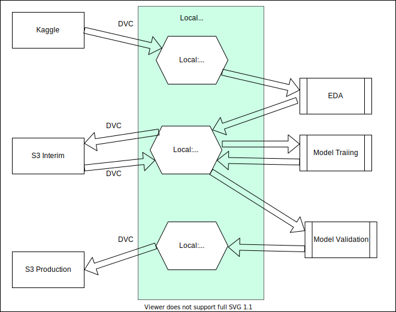

# Design

The intent of this folder is to capture high level design information 
about the product recommendation model, the flow of data, etc.

The data goes through what can be thought of as 3 stages:
1. Public - this is the public data gathered from various sources. Initially all the data comes from different Kaggle datasets.
2. Interim - this is where the data is stored after it is cleaned. This is also the area where trained model weights are stored before the models are validated.
3. Production - this is where the trained models that are ready for production are stored.

